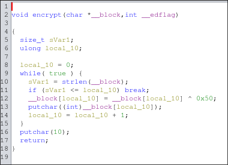

# Break the Battalion

## Flag
bronco{2"97145}
## Intended Solution:
You cannot use a debugger like GDB for this, you must use a decompiler. For this solution we will be using Ghidra.

After opening the decompiled code into Ghidra we can first take a look at the decompiled main function.

The first thing we should notice is that the program takes an input through the `scanf` function but does not have a second parameter as required. However, by taking a look at the variables present we can assume it is `local_118` as there are no other strings.

Just after this, the `local_118` variable, along with its `iVar1` (which is just `local_118` casted to an int) is passed into the encrypt function. Which is decompiled as so:

Here we can see a while loop and some new variables, and by taking a closer look we can see this is essentially a for loop. `local_10` is set to 0 in line 8 and `sVar1` is established as the length of the string in line 10. On line 11 it is checked to make sure `local_10` is not equal to or more than the length of the string. Knowing that all of these contribute to making a for loop iterating through the string, we can focus on lines 12 an 13.

On line 12 we can see the character of the string at index `local_10` is changed to be an result of an XOR between itself and 0x50.

Going back to our main function, we can see that the successful output from the encrypt function should result in "brigade"

Knowing that XOR is reversible, we can first input "brigade" into the command line, and then take the output of 2"97145 and throw it back into the program. Doing this will give us will result in "correct password" being printed, making bronco{2"97145} the correct flag.