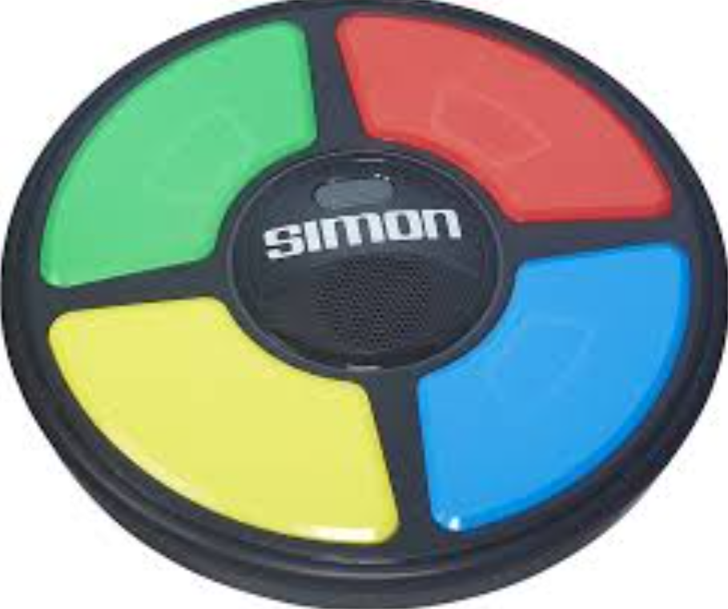

# Simon Says Scan This

## Flag

bronco{0h_i_s33}

## Intended Solution:

qr_code_p2.png is scrambled, but is color coded.

Arrange it in Simon Says ordering:

Then, overlay qr_code_p1.png on top of that.

After scanning the qr code with your phone, the flag will display.
